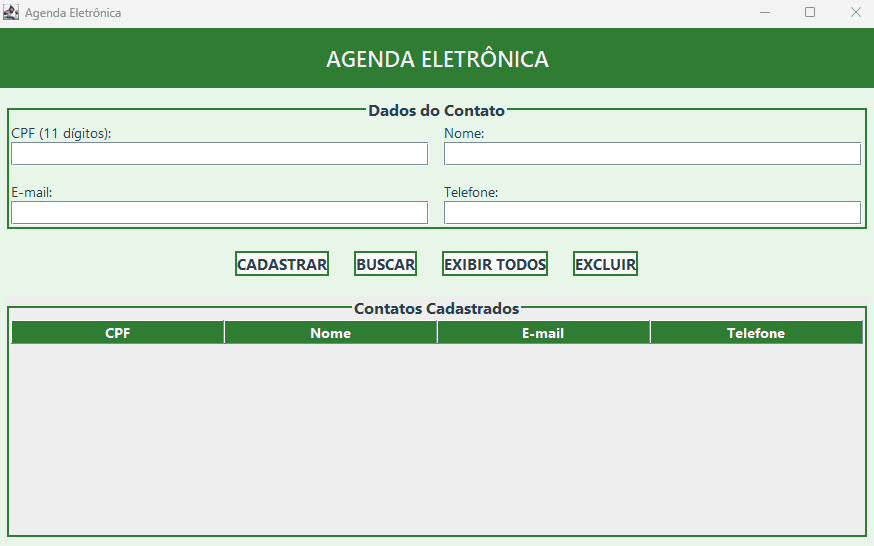

<h1 align="center">📒 Agenda Eletrônica em Java (Swing)</h1>

  

Projeto desenvolvido em Java utilizando os conceitos de Programação Orientada a Objetos (POO) e interface gráfica com Java Swing.
A aplicação permite o cadastro, busca, exclusão e listagem de contatos, aplicando encapsulamento e separação entre lógica e interface.

⸻

🎯 Objetivo do Projeto

Este projeto foi desenvolvido como atividade avaliativa da disciplina Programação Orientada a Objetos, do curso superior de Análise e Desenvolvimento de Sistemas, da Universidade Estadual do Maranhão (UEMA), com o objetivo de:

•	Aplicar os princípios da POO, principalmente encapsulamento;

•	Trabalhar com listas e manipulação de objetos;

•	Integrar lógica de negócio com interface gráfica (Java Swing);

•	Desenvolver uma aplicação funcional e organizada.

⸻

🛠️ Tecnologias Utilizadas

•	Java

•	Java Swing

•	POO (Encapsulamento, Classes, Métodos, Construtores)

•	JTable para exibição de dados

⸻

📂 Estrutura do Projeto
<pre>
src/main/java/com/mycompany/agendaeletronica
├── Agenda.java   	     
├── AgendaEletronica.java      
├── Contato.java 
└── Main.java    
</pre>

⸻
<pre>

🧩 Funcionalidades
	•	✅ Cadastrar novos contatos
	•	🔍 Buscar contatos pelo CPF
	•	❌ Excluir contatos
	•	📋 Exibir todos os contatos cadastrados em uma tabela
	•	⚠️ Validações simples (CPF e e-mail não podem ser vazios)
</pre>
⸻

🧑‍💻 Conceitos de POO Aplicados
<pre>
	•	Encapsulamento
    •   Todos os atributos das classes são privados e acessados por meio de getters e setters.
	•	Separação de responsabilidades
	•	Contato: modelo de dados
	•	Agenda: regras de negócio
	•	AgendaGUI: interface gráfica
	•	Reutilização e organização do código
</pre>
⸻

▶️ Como Executar o Projeto
	1.	Clone este repositório:

git clone https://github.com/JairoDias22/Projeto_Agenda_Java

	2.	Abra o projeto em uma IDE Java (IntelliJ, Eclipse ou VS Code)
	3.	Execute a classe: Main.java

A interface gráfica da agenda será exibida.

⸻

🖥️ Interface Gráfica

A aplicação utiliza Java Swing, com os seguintes componentes:
<pre>
	•	JFrame
	•	JPanel
	•	JLabel
	•	JTextField
	•	JButton
	•	JTable
</pre>
A interface é simples, intuitiva e permite fácil interação com o sistema.

⸻

👨‍🎓 Autores

RAIMUNDO JAIRO DA SILVA DIAS

JERFFESON CARLOS DOS SANTOS SOUSA

⸻

📄 Licença

Este projeto foi desenvolvido para fins educacionais.

⸻
